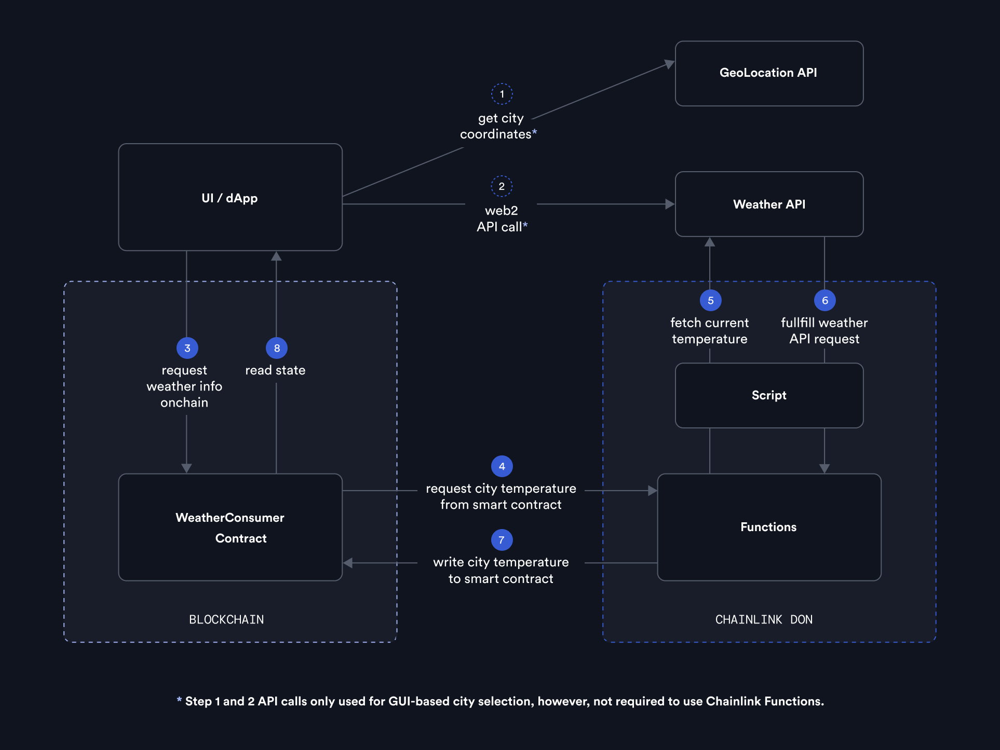

> **Note**
>
> _This demo represents an educational example to use a Chainlink system, product, or service and is provided to demonstrate how to interact with Chainlink’s systems, products, and services to integrate them into your own. This template is provided “AS IS” and “AS AVAILABLE” without warranties of any kind, it has not been audited, and it may be missing key checks or error handling to make the usage of the system, product or service more clear. Do not use the code in this example in a production environment without completing your own audits and application of best practices. Neither Chainlink Labs, the Chainlink Foundation, nor Chainlink node operators are responsible for unintended outputs that are generated due to errors in code._

# Chainlink Functions Demo dApp

This project is an example dApp, designed to run on the Fuji testnet (Avalanche), that uses [Chainlink Functions](https://docs.chain.link/chainlink-functions/). It demonstrates how to use Chainlink Functions in a full-stack implementation with a real smart contract code, coupled with an easy to follow guidance on how it works under the hood. The functionality allows users to query a city's temperature from a web2 API and then write it on-chain via a smart contract.

Chainlink Functions is used to determine the input city's current temperature. 

**NOTE**: This example is not production ready, as edge cases are not handled.

## Usage

The dApp is designed so the end user does not have to connect a wallet nor create a Chainlink Functions subscription. This is all handled by the dApp.

## Architecture

This dApp consists of two parts: the contracts and the web UI.

### Overview



## Frontend

The `./app` directory is a Next.js project bootstrapped with [`create-next-app`](https://nextjs.org/docs/pages/api-reference/create-next-app).

It contains the frontend for the Chainlink Functions playground demo dApp.

### Quick Start

Install all dependencies:

```bash
cd app
npm install
```

Set environment variables by copying `.env.example` to `.env` and filling in the values:

- `NEXT_PUBLIC_GTM_ID` Google Analytics id.
- `GEOCODING_API_KEY` - API KEY from API Ninjas used for geocoding.
- `CONTRACT_ADDRESS` of the deployed contract.
- `NETWORK_RPC_URL` - Avalanche testnet RPC endpoint.
- `PRIVATE_KEY` - for the signing and broadcasting transactions in the backend.

For enabling ratelimiting you need to also fill in the following `.env` variables:
- `KV_URL` - Vercel KV URL
- `KV_REST_API_URL` - Vercel KV REST API url
- `KV_REST_API_TOKEN` - Vercel KV REST API token
- `KV_REST_API_READ_ONLY_TOKEN` - Vercel KV REST API read only token
- `RATELIMIT_IP_EXCEPTION_LIST` - list of IPs which should be excluded from the ratelimit functionality, separated with comma (ex. `"127.0.0.1,8.8.8.8,1.1.1.1"`)

You can get those from your Chainlink platform coordinator.

Run `npm run dev` in your terminal, and then open [localhost:3000](http://localhost:3000) in your browser.

### Tech Stack

-   [Next.js](https://nextjs.org/)
-   [TypeScript](https://www.typescriptlang.org/)
-   [Tailwind CSS](https://tailwindcss.com/)
-   [shadcn/ui](https://ui.shadcn.com/)
-   [Ethers](https://docs.ethers.io/v5/)

## Contracts

`./contracts` folder is a Hardhat project with a full Chainlink Functions enabled smart contract implementation.

### Project Details

`WeatherConsumer.sol` contract implements a Chainlink Functions consumer which runs a weather request check for the provided geolocation on the set weather API.

### Tech Stack

-   [hardhat](https://hardhat.org/)

### Quick start

1. Install dependencies

```bash
cd contracts
npm install
```

2. Obtain the values for following environment variables:
   - `PRIVATE_KEY` for your development wallet - `POLYGON_MUMBAI_RPC_URL`, `ETHEREUM_SEPOLIA_RPC_URL`, or `AVALANCHE_FUJI_RPC_URL`
   - `POLYGONSCAN_API_KEY`, `ETHERSCAN_API_KEY`, or `FUJI_SNOWTRACE_API_KEY` blockchain explore API keys depending on which network you're using

3. Set the required environment variables. For improved security, Chainlink provides the NPM package [@chainlink/env-enc](https://www.npmjs.com/package/@chainlink/env-enc) which can be used to keep environment variables in a password encrypted `.env.enc` file instead of a plaintext `.env` for additional security. More detail on environment variable management and the tooling is provided in the [Environment Variable Management](#environment-variable-management) section.
   1. Set an encryption password for your environment variables to a secure password by running `npx env-enc set-pw`. This password needs to be set each time you create or restart a terminal shell session.<br>
   2. Use the command `npx env-enc set` to set the required environment variables.

### Deploy

1. Locally simulate the execution of your JavaScript source by running `npx hardhat functions-simulate-script`

2. Create and fund a new Functions billing subscription using the [Chainlink Functions UI](https://functions.chain.link) and add the deployed consumer contract as an authorized consumer to your subscription. You can also do this programmatically with `npx hardhat functions-sub-create --network network_name_here --amount LINK_funding_amount_here --contract 0x_deployed_client_contract_address_here`<br>**Note**: Ensure your wallet has a sufficient LINK balance before running this command. Testnet LINK can be obtained at <a href="https://faucets.chain.link/">faucets.chain.link</a>. Also make a note of your subscription Id as you will need it for most commands.

3. Deploy and verify the consumer contract to an actual blockchain network by running `npx hardhat deploy-weather-consumer --network network_name_here --subid your_sub_id --verify true`<br>**Note**: Make sure `<explorer>_API_KEY` is set if using `--verify true` depending on which network is used.

### Environment Variable Management

This repo uses the NPM package `@chainlink/env-enc` for keeping environment variables such as wallet private keys, RPC URLs, and other secrets encrypted at rest. This reduces the risk of credential exposure by ensuring credentials are not visible in plaintext as they are with [.env files](https://www.npmjs.com/package/dotenv).

By default, all encrypted environment variables will be stored in a file named `.env.enc` in the root directory of this repo. This file is `.gitignore`'d.

First, set the encryption password by running the command `npx env-enc set-pw`.

> **NOTE:** On Windows, this command may show a security confirmation.

The password must be set at the beginning of each new session.
If this password is lost, there will be no way to recover the encrypted environment variables.

Run the command `npx env-enc set` to set and save environment variables.
These variables will be loaded into your environment when the `config()` method is called at the top of `networks.js`.

Use `npx env-enc view` to view all currently saved environment variables.
After pressing _ENTER_, the terminal will be cleared to prevent these values from remaining visible.

Running `npx env-enc remove VAR_NAME_HERE` deletes the specified environment variable.

The command `npx env-enc remove-all` deletes the entire saved environment variable file.

When running this command on a Windows machine, you may receive a security confirmation prompt. Enter `r` to proceed.

> **NOTE:** When you finish each work session, close down your terminal to prevent your encryption password from getting exposed if your machine is compromised. You will need to set the same password on future session to decrypt the `.env.enc` file.

## Disclaimer
> :warning: **Disclaimer**: The code used in this Chainlink Functions quickstart template comes from Chainlink community members and has not been audited. The Chainlink team disclaims and shall have no liability with respect to any loss, malfunction, or any other result of deploying a Quickstart Template. By electing to deploy a Quickstart Template you hereby acknowledge and agree to the above.
